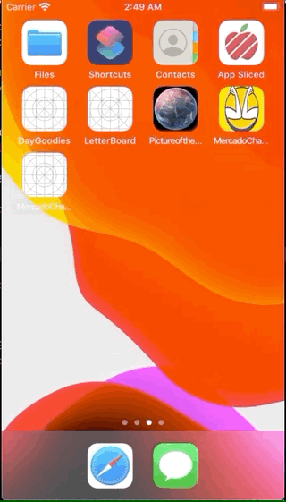

# MercadoChallenge

Example project with a master and detail view that consumes Mercado Libre API.

## This project showcases
- Model View Presenter Architecture.
- REST API Request with URL Session (No external libraries).
- Swift 5.
- Unit Tests
- UI Tests

## Author

Andrés Acevedo
